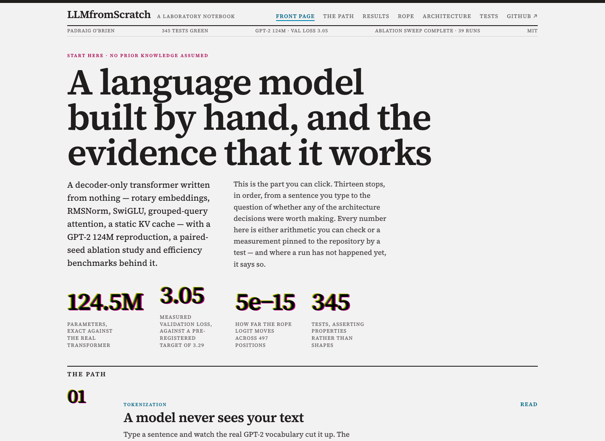
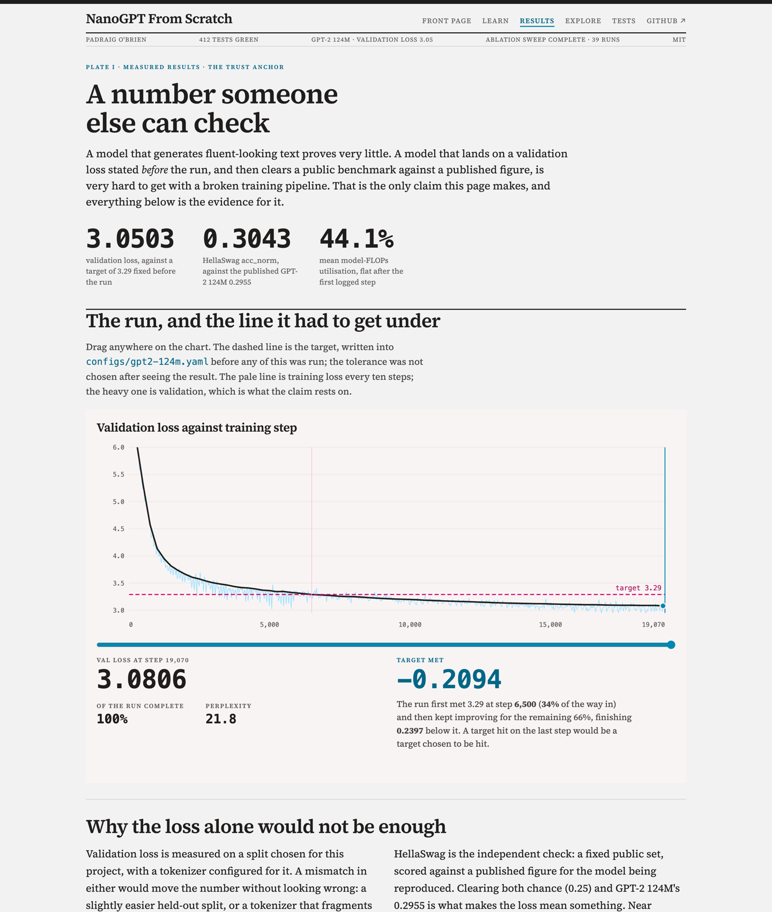

# NanoGPT From Scratch

A from-scratch decoder-only language model that **reproduces GPT-2 124M**
(validation loss **3.0503** against a 3.29 target, HellaSwag **0.3043** against the
reference 0.2955), extended with modern architecture components, a paired-seed
ablation study, and efficiency benchmarks. Reproducible from one command.

[](https://github.com/Padraigobrien08/nanogpt-from-scratch/actions/workflows/ci.yml)
[](https://padraigobrien08.github.io/nanogpt-from-scratch/)

**→ [Open the interactive site](https://padraigobrien08.github.io/nanogpt-from-scratch/)**: the
results, as figures you can move instead of tables you have to trust.

- Drag a scrubber along [the reproduction](https://padraigobrien08.github.io/nanogpt-from-scratch/#/reproduction)
  and watch it cross a target fixed before the run.
- Put the mask bug back and watch [the KV cache](https://padraigobrien08.github.io/nanogpt-from-scratch/#/efficiency)
  go from losing to winning.
- Slide gradient accumulation and watch [a two-parameter model](https://padraigobrien08.github.io/nanogpt-from-scratch/#/scaling)
  land on points it was never shown.
- Toggle a design decision in [the ablation playground](https://padraigobrien08.github.io/nanogpt-from-scratch/#/ablations)
  and get a paired delta, its per-seed values, and "not a result" when the seeds disagree.

It opens with an [explainer that assumes no prior knowledge](https://padraigobrien08.github.io/nanogpt-from-scratch/#/chapter/1)
and ends with [RoPE's defining property holding as you move two tokens](https://padraigobrien08.github.io/nanogpt-from-scratch/#/rope)
and [every attention weight in the model](https://padraigobrien08.github.io/nanogpt-from-scratch/attention/),
per layer and per head.

<!-- Two screenshots of the same page, doing different jobs, so re-shoot both when the front
     page changes: front-page.png is this hero at 1440x1050, and social-preview.png is the
     GitHub card at 1280x640 — that slot is 2:1 and would crop a third off this one. Both are
     captured from the deployed site at twice the size and scaled down, so the type holds. -->
[](https://padraigobrien08.github.io/nanogpt-from-scratch/)

Every architecture component here (rotary embeddings, RMSNorm, SwiGLU,
grouped-query attention, the KV cache) is written by hand and covered by tests that
assert its defining mathematical property, not just its output shape.

---

## Reproduction

The trust anchor: a documented target, hit within a tolerance fixed *before* the run.

| | achieved | target | |
| --- | --- | --- | --- |
| Validation loss, full 100M-token split | **3.0503** | ≤ 3.29 | **−0.2397** |
| Perplexity | **21.12** | — | |
| HellaSwag `acc_norm` | **0.3043** | 0.2955 (GPT-2 124M) | **+0.0088** |


Crossed the target at step 6,500 (34% of the run) and kept improving. **44.1% MFU
held flat for seven hours**, ~401,000 tokens/sec on one H100, ~$23 of GPU time.

**HellaSwag is what makes the loss trustworthy.** Validation loss is measured on a
split we chose with a tokenizer we configured; a mismatch in either would move the
number without looking wrong. HellaSwag is a fixed public set scored against a
published figure, so clearing both chance (0.25) and the GPT-2 124M reference is the
independent check. Near 0.25 and the loss would have meant nothing.

Protocol, target provenance, hardware, and sample generations:
[docs/reproduction.md](docs/reproduction.md).

---

## Architecture

One `Transformer` class covers both the GPT-2 baseline and the modern Llama-style
stack; which one you get is decided entirely by config. That is deliberate: an
ablation that swaps LayerNorm for RMSNorm differs from its baseline by one line of
YAML, so the two cannot silently drift apart.

| Component | Baseline (`gpt2-124m`) | Modern (`llama-124m`) |
| --- | --- | --- |
| Normalisation | LayerNorm | **RMSNorm** (fp32 reduction) |
| Position | Learned absolute table | **RoPE** |
| Feed-forward | GELU, 4×d | **SwiGLU**, parameter-matched via 2/3 width scaling |
| Attention | 12 query / 12 KV heads | **GQA**, 12 query / 4 KV heads (3× smaller cache) |
| Bias terms | Yes | No |
| Inference | — | **Static preallocated KV cache** |

```python
from llmfs import ModelConfig, Transformer

model = Transformer(ModelConfig(
    n_layer=12, n_head=12, n_kv_head=4, n_embd=768, block_size=1024,
    norm="rmsnorm", pos_emb="rope", mlp="swiglu", bias=False,
))
```

### What the tests actually assert

Shape checks catch typos; these catch the bugs that would otherwise survive all the
way into a training run and only show up as a mysteriously worse loss:

- **RoPE**: that `⟨R(q, m), R(k, n)⟩` depends only on `m − n`, to 1e-6, which is the
  entire point of rotary embeddings and is not implied by any shape.
- **Causality**: perturbing token *t* leaves every position `< t` bitwise unchanged.
  Run across all 10 architecture variants. An off-by-one mask makes loss look *better*.
- **KV cache**: incremental decoding reproduces a full forward pass at every
  position, for every variant. Training never exercises the cache, so nothing else
  would catch a stale offset or a double-rotated key.
- **GQA**: with `n_kv_head == n_head`, output is numerically identical to plain MHA.
- **Eager vs fused**: the attention-weight export path matches the SDPA kernel, so
  the visualizer cannot show weights the model never used.
- **Mask alignment**: `build_causal_mask` is bottom-right aligned. PyTorch's
  `is_causal=True` is top-left aligned and is silently wrong whenever the query block
  is shorter than the key sequence, i.e. on every decode step.
- **That the decode step takes the *fast* path**, not merely the correct one: a test
  records what reaches SDPA and asserts no mask arrives on a single-token step, because
  passing one forfeits the fused kernel. Every other test here checks the cache's
  answer; this is the one that checks its speed, and its absence hid a 30% regression
  behind a green suite.

```bash
pytest tests -q
```

---

## Quickstart

```bash
git clone https://github.com/Padraigobrien08/nanogpt-from-scratch.git && cd nanogpt-from-scratch
uv venv && uv pip install -e ".[dev,train]"
```

Train a small model on the included corpus in a couple of minutes, on CPU, MPS or
CUDA, no download required. This is the smoke test that every code path a real run
takes is exercised before renting a GPU:

```bash
llmfs-prepare-data --source text --input data/wizard_of_oz.txt --out-dir data/wizard
```

```bash
llmfs-train --config debug
```

```bash
llmfs-generate --checkpoint out/debug/best.pt --prompt "Dorothy lived in the"
```

The full reproduction, on a rented GPU:

```bash
llmfs-prepare-data --source fineweb-edu --out-dir data/fineweb-edu-10B
```

```bash
llmfs-train --config gpt2-124m
```

Multi-GPU is the same config: gradient accumulation absorbs the world size, so the
optimisation is unchanged and only throughput moves:

```bash
torchrun --nproc_per_node=8 -m llmfs.train.cli --config gpt2-124m
```

On a rented pod, [`scripts/gpu.sh`](scripts/gpu.sh) drives the whole thing over SSH:
setup, data, detached run, monitoring, and fetching results back. Jobs run inside
tmux so a dropped connection cannot kill something you are paying for.
[docs/gpu-runbook.md](docs/gpu-runbook.md) is the operational guide.

```bash
./scripts/gpu.sh setup && ./scripts/gpu.sh sweep && ./scripts/gpu.sh watch
```

Every run writes its fully-resolved config, `metrics.jsonl`, and atomic checkpoints
to `out/<run_name>/`. Resume with `--resume auto`.

---

## Ablation study

Twelve arms against a shared baseline: eleven vary exactly one design decision, and
`modern-stack` combines them to test whether the individual deltas actually add up.
Run at a smaller scale than the reproduction (8 layers, 512-wide, 524M tokens per run) so
the whole sweep is affordable and every arm can share its seeds and its token budget with
the baseline. Twelve arms plus the baseline, at three seeds each: 39 runs.

Axes: LayerNorm vs RMSNorm · learned vs RoPE vs none · GELU vs SwiGLU · tied vs untied
embeddings · bias vs no bias · MHA vs GQA · cosine vs WSD schedule · weight decay ·
learning rate (3e-4 / 1e-3 / 3e-3) · all modern components combined.

The discipline this rests on is enforced by a test: every arm is asserted to differ
from `configs/ablations/_base.yaml` in its own named axis and nothing else. An arm
that drifted would be measuring something other than what it claims.

```bash
llmfs-ablate --seeds 3
```

```bash
llmfs-ablate-report
```

**Every arm runs at the same three seeds, and comparisons are paired.** That is the
point of the design, not a detail. Two runs differing only in seed do not reach the
same loss, so an unpaired comparison has to clear that entire spread before it can
claim anything, and most architecture effects are smaller than it. Differencing each
arm against the baseline run that saw its data *in the same order* cancels the
batch-ordering variance the two share, and resolves effects well below the raw noise
floor.

An arm counts as a result only when the range of its per-seed deltas does not
straddle zero: every seed agreed on the direction. A deliberately blunt rule, not a
p-value (with three seeds nothing stronger would be honest), and it is exactly what
the error bars in the plot show. An ablation table without that check is worse than
no table: it reads as authoritative while recommending changes that do nothing.

The runner is built for a multi-hour job on rented hardware: it skips arms that
already have a result, writes after every arm, and records a diverged arm as a
finding rather than dying on it: the `lr-3e-3` arm is *expected* to blow up.

### Results

**[Full write-up: docs/ablations.md](docs/ablations.md)**: 39 runs, 7.6 GPU-hours on
one H100, ~$25. Baseline 3.9116, seed noise floor **0.0043**.

| Arm | Δ val loss | Δ throughput |
| --- | --- | --- |
| `lr-3e-3` | **−0.1251** | +1.1% |
| `sched-wsd` | **−0.1034** | +0.8% |
| `modern-stack` | **−0.0886** | ±0.0% |
| `pos-rope` | **−0.0886** | −2.3% |
| `mlp-swiglu` | **−0.0341** | −2.2% |
| `norm-rmsnorm` | +0.0007 *(within noise)* | +1.3% |
| `no-bias` | +0.0038 | **+4.2%** |
| `gqa-2` | +0.0311 | +2.0% |
| `lr-3e-4` | +0.4457 | +0.9% |


Three things worth pulling out:

- **The optimiser dominates the architecture.** Learning rate and schedule move loss
  more than every architecture change combined. RMSNorm vs LayerNorm is worth 0.0007;
  the learning rate is worth 0.1251, 171× more.
- **The components are additive.** Summing the five individual modern-stack parts
  predicts −0.0872; the combined arm measured −0.0886. The 0.0014 gap is 33% of the
  0.0043 noise floor, so they compose without measurably interacting.
- **Loss is the wrong single metric.** Among the five *architecture* arms the two that
  improve loss both cost throughput and the three that cost loss all improve it, a
  trade the loss column alone cannot show. It is not a universal law, and the optimiser
  arms are the counter-example: `lr-3e-3` and `sched-wsd` take both. `modern-stack`
  combines the five to −0.0886 for ±0.0%.

The prediction that `lr-3e-3` would diverge was wrong: it won. That means every arm
was measured at a learning rate now known to be suboptimal, which is the study's
largest caveat and is stated as such in the write-up.

---

## Efficiency

All at the 124M configuration. Training figures are from the H100 that trained the model
(measured 808 TFLOP/s dense bf16); inference, quantization and speculative decoding are
from a rented RTX 4090 (measured 167.9 TFLOP/s, ~$0.06 for the whole benchmark run). Every
result carries its provenance: GPU, arch, driver, torch build, measured TFLOP/s, and the
commit that produced it.

### Training throughput

| Variant | tokens/sec | peak memory | MFU |
| --- | --- | --- | --- |
| baseline | 298,199 | 14.5 GiB | 32.8% |
| **`torch.compile`** | **377,315** | 14.5 GiB | **41.5%** |
| gradient checkpointing | 259,874 | 10.3 GiB | 28.6% |
| compile + checkpointing | 336,637 | 10.0 GiB | 37.0% |
| **compile + micro-batch ×2** | **396,860** | 27.8 GiB | **43.6%** |
| compile + checkpoint + batch ×4 | 363,369 | 35.2 GiB | 39.9% |

`torch.compile` is worth **+26.5%** throughput for nothing. Gradient checkpointing is
the more interesting row: it costs 13% throughput to save 29% of activation memory,
and on an 80GB card holding a 124M model that trade never pays; the last two rows show
checkpointing with a 4× batch losing to compile with a 2× batch. Checkpointing is for
when memory is the binding constraint, and here it is not. Reporting it as a win
because it saves memory would have been the easy mistake.

The same sweep on the 24 GiB 4090 shows the other side of that, and the contrast is the
point of running it twice:

| Variant | tokens/sec | peak memory | MFU |
| --- | --- | --- | --- |
| baseline | 104,260 | 14.5 GiB | 68.7% |
| **`torch.compile`** | **118,250** | 14.5 GiB | **77.9%** |
| gradient checkpointing | 92,095 | 10.3 GiB | 60.7% |
| compile + checkpointing | 107,855 | **9.9 GiB** | 71.1% |
| micro-batch ×2 | **OOM** | — | — |
| checkpoint + batch ×4 | **OOM** | — | — |

Two things invert. **MFU nearly doubles**, 77.9% against 41.5% for the same code and the
same compile speedup (+13.4%), because a 124M model cannot keep an H100 busy; the H100's
low MFU was a statement about the model being too small for the GPU, not about the code.
And the memory ceiling that "never pays" on 80 GiB binds immediately on 24 GiB: the ×2
micro-batch that was the *fastest* H100 configuration simply does not fit, while
checkpointing holds peak memory to 9.9 GiB for 9% throughput. So checkpointing is worth
exactly what the card makes it worth.

One gap, since it is the obvious question: the variant that would settle it (checkpointing
*plus* the ×2 batch, the config that might fit only with checkpointing) is not in the
sweep. The list was written for an 80 GiB card, where nothing needed rescuing.

### Inference, and a bug the benchmark found

An earlier version of this README reported that the KV cache gave no speedup, and
explained it as a property rather than a defect: decode is bound by streaming weights
from memory, not by attention over the prefix. It also admitted the benchmark ought to
sweep sequence length, since that is the axis a cache exists for. The sweep got
written, and it showed the cache losing at every length: **34% slower** at 128 tokens,
still 18% slower at 1024, with its throughput almost flat across a sweep where the
recompute path fell steadily. Flat throughput is the signature of a fixed per-step
cost, not of attention. A cache that does strictly less arithmetic cannot lose on
work; it can only lose on overhead.

The cause was three lines. A decode step has `q_len == 1`, so it took the branch that
builds an explicit causal mask, and **passing `attn_mask` to SDPA disqualifies it from
the fused flash kernels**, dropping it onto the math backend, while the naive path kept
`is_causal=True` and stayed fused. For a single query every cached key precedes it, so
that mask was all-`True`: pure cost, no information. Removing it (RTX 4090, sweeping
total sequence length from 128 to 1024, a 32-token prompt plus the rest generated):

| Total length | naive | KV cache | advantage | gain from the fix |
| --- | --- | --- | --- | --- |
| 128 | 247 tok/s | 218 | 0.88× | **1.30×** |
| 512 | 247 | 223 | 0.90× | **1.30×** |
| 1024 | 197 | 222 | **1.12×** | **1.38×** |

The naive column moved 0.97–1.01×, the untouched control that makes this a measurement
rather than a coincidence. The original explanation was directionally right and
quantitatively wrong: decode at this scale *is* overhead-bound, which is why the cache
curve is flat, but the crossover is real and lands at **1024 tokens**, exactly this
model's `block_size`.

I wrote "a real result rather than a bug" about a number that was both, and the
plausibility of the explanation is what stopped me looking. **A plausible story for a
disappointing measurement is the most expensive kind of mistake**: it converts a bug
into a finding and closes the investigation. What broke it open was the shape of the
data, not the headline: an explanation that fits one number but not the curve is not yet
an explanation. The gap was in the tests too: every test asserted the cache produced
the right *answer*, none that it took the fast *path*, so a 30% regression passed a green
suite. Two now do, both mutation-checked.

Batching is where the cache is unambiguously worth it, because it is what makes a batch
affordable at all: **16.5× throughput from batch 1 to 16** (219 → 3,622 tok/s) for
216 MiB of cache.

### Multi-GPU scaling

**[Full report: docs/scaling.md](docs/scaling.md)**: 8× RTX 5090, no NVLink.

| GPUs | grad accum | tokens/sec | efficiency | achieved | max Δloss vs 1 GPU |
| --- | --- | --- | --- | --- | --- |
| 1 | 32 | 185,928 | — | 202 TFLOP/s | baseline |
| 2 | 16 | 366,469 | 98.6% | 398 TFLOP/s | 1.6e-05 |
| 4 | 8 | 721,904 | 97.1% | 785 TFLOP/s | 1.4e-05 |
| 8 | 4 | **1,414,340** | **95.1%** | **1,538 TFLOP/s** | 4.4e-05 |

**95.1% at 8 GPUs over the worst interconnect in the building.** `nvidia-smi topo -m` is
recorded in the results file: no NVLink, and a dual-socket box where GPUs 0–3 and 4–7 sit
on different NUMA nodes, so the 8-way all-reduce crosses the inter-socket link. Per-GPU
throughput still fell only 4.9%.

That is `no_sync` earning its place, and it was *measured* on the machine, not argued
from the code. Holding the world size at 8 and varying the
batch so accumulation goes 8 → 4 → 2 → 1:

| accum @ 8 GPUs | tokens/step | 8 GPU tok/s | efficiency |
| --- | --- | --- | --- |
| 8 | 1,048,576 | 1,440,267 | 96.6% |
| 4 | 524,288 | 1,410,960 | 95.2% ← control, reproduces the row above to 0.24% |
| 2 | 262,144 | 1,363,111 | 92.1% |
| 1 | 131,072 | 1,270,772 | **86.0%** |

With one all-reduce per micro-batch, efficiency falls to 86.0%. So communication is exactly
what the accumulation was hiding. A two-parameter fit to the accum 8 and 4 points
(`loss = 1.975 + 11.134/accum` percentage points) predicted the other two **before they were
measured**, to within 0.85 points across a further 4× range.

The mechanism itself is pinned by the suite, not only by the sweep: two gloo processes run
the real trainer and count DDP's suppressed syncs, asserting `grad_accum - 1` of them per
optimiser step. Deleting `no_sync` costs throughput and nothing else, so without that count
a CPU test run has no way to see it go.

The honest reading is therefore **the interconnect matters exactly as much as the batch
fails to hide it**: at the reproduction's configuration a perfect interconnect could
recover about 2.8 points.

**The throughput is the easy half.** The claim worth checking is that eight GPUs still take
the *same* optimisation steps as one: `tokens_per_step` is fixed in tokens and accumulation
is derived from it, which the accum column shows working. The loss at step 1:

```
1 GPU: 10.951740264892578      4 GPU: 10.951740264892578
2 GPU: 10.951740264892578      8 GPU: 10.951739311218262
```

Identical to sixteen significant figures at 1, 2 and 4 GPUs. Over 50 steps the largest
divergence is 4.4e-05 against a loss of ~8.6, and it does not grow with world size; that
is floating-point reduction order, not drift. Verifying it first required all-reducing the
logged training loss, which had been rank 0's own micro-batches: correct optimisation, but
a number that described one Nth of the batch and got noisier as the world grew.

**A full training step runs at 86% of a bare matmul.** Rather than paste a spec-sheet peak
into the MFU column, the card was benchmarked on the same pod: an 8192³ bf16 matmul reached
**234.7 TFLOP/s**. Against that measured ceiling the training step extracts 86.1% at 1 GPU
falling to 81.9% at 8, the same 4-point cost as the scaling loss, denominated in the
hardware's own capability. It also settles why `mfu` is `null` everywhere: the figure most
often quoted for a 5090 is 209.5 TFLOP/s, and *we measured above it*, so it cannot be the
peak; entering it would have reported 96% MFU. That column stays absent, not wrong.

And **97% of the 8-GPU run was not training**: ~690s of fixed overhead (probably per-bucket
compile under DDP) against 18.5s of stepping, which is why my own 10-minute estimate for the
sweep became 39.

### Quantization and speculative decoding

Both hand-implemented and measured. **[Full results: docs/efficiency.md](docs/efficiency.md)**

| Quantization | Memory | Perplexity | Δ ppl | Decode |
| --- | --- | --- | --- | --- |
| fp32 baseline | 475 MiB | 19.091 | — | 191.8 tok/s |
| **int8 g128** | 237 MiB (2.00×) | 19.103 | **+0.013** | 139.8 (0.73×) |
| **int4 g128** | 196 MiB (2.42×) | 20.442 | **+1.351** | 94.1 (0.49×) |
| int4 per-channel | 192 MiB (2.47×) | 22.664 | +3.574 | 94.4 (0.49×) |

| Speculative decoding | Speedup | Acceptance | Tokens/target fwd |
| --- | --- | --- | --- |
| **prompt-lookup, code-like text** | **5.35×** | 97.4% | 7.53 |
| prompt-lookup, prose | 2.73× | 66.7% | 3.28 |
| prompt-lookup, repetitive text | 2.39× | 100% | 2.98 |
| model-draft, code-like text | 1.08× | 95.8% | **8.53** |

Four findings, each reported against the flattering framing:

- **Speculative decoding is verified lossless.** All 18 benchmark runs reproduced
  greedy decoding token-for-token; tests assert it across every `k` and four drafters
  including adversarial ones. An implementation that were merely *close* would not be a
  faster decoder, it would be a different model.
- **Acceptance rate and speedup are different questions.** The last row is the lesson:
  95.8% acceptance and 8.53 tokens per target forward pass (essentially the algorithmic
  ideal), returning 1.08×, level after overhead, because the draft model is the same size
  as the target. A drafter must be cheap first and accurate second.
- **Grouping is worth 2.2 perplexity points at 4 bits.** One scale shared across a whole
  output channel is set by its largest outlier; per-128-feature groups confine the damage.
  (The coarse rows are per channel, not per tensor; they were mislabelled until
  2026-08-16; see [docs/efficiency.md](docs/efficiency.md#grouping-is-worth-22-perplexity-points-at-4-bits).)
  And **HellaSwag could not measure any of this**: a 1.5-point standard error at n=1000
  swallowed every scheme, which is why the quality column is perplexity.
- **Every quantized scheme is slower**: −27% at int8, −51% at int4. Dequantize-then-matmul
  materialises a full-size weight, so bytes moved go *up*. The memory saving is in what is
  stored; a fused kernel is what would make it a speed saving. Compression also caps at
  2.47× (2.42× for `g128`, the scheme actually worth using), not 8×, because the tied
  token embedding is 31% of this model.

Memory and quality are device-independent; throughput is not, and this section is the
evidence for that. Moving from MPS to CUDA flipped the sign of the prose speculative
result (0.76× → 2.73×), so the earlier claim that prompt-lookup "loses on prose" was a
statement about MPS, not about the method. Single-device throughput measures a
device-algorithm pair.

---

## Interactive site

**[padraigobrien08.github.io/nanogpt-from-scratch](https://padraigobrien08.github.io/nanogpt-from-scratch/)**

**The site is the paper, not documentation of one.** Each of the four results above is a
plate built around a single interactive figure, chosen so that the interaction *is* the
explanation: the four bullets at the top of this page are those plates. A target hit on
the last step would be a target chosen to be hit; on the reproduction plate that is a
difference you can see, at step 6,500, a third of the way in.

[](https://padraigobrien08.github.io/nanogpt-from-scratch/#/reproduction)

Two pages exist to answer the question a researcher asks next: *is any of this
actually held down?* **The architecture page** puts the nine blocks of the stack down
one column with a GPT-2 / Llama tab and a detail panel: every parameter count comes
from a calculator pinned exactly to the real `Transformer` across twelve
configurations, every config value from resolving the shipped YAML through the
repository's own loader, and every "what holds it" line names a test that was read
before it was cited; two blocks say they have no property test, because they do not.
**The test page** refuses to lead with a test count and shows a dozen claims instead:
what each test asserts and the bug it exists to catch. Those rows are collected from
`@pytest.mark.showcase` by pytest itself, so a rename cannot leave the page
advertising a guarantee the suite no longer provides.

**"How a language model actually works"** is the on-ramp: eight steps from a sentence
you type to a model that predicts what comes next, with something to poke at instead of
something to take on faith at each one. The three things that run in the browser and
would normally be hand-waved (the **BPE tokenizer**, the **parameter accounting**, the
**sampler**) are each pinned by test to the Python that produced them, down to the
off-by-one that makes `top_p = 0` sample from nothing. The sampling distribution is a
bigram model counted from `data/wizard_of_oz.txt`: real statistics, and the model this
project began as (public domain; see [data/README.md](data/README.md)).

**The RoPE explorer** puts the property this repository tests for on screen: drag a
query and a key along a sequence and the attention logit between them does not move,
as long as the distance between them does not. The rotation it draws is a TypeScript
port of `src/llmfs/model/rope.py`, and the two are pinned together **in both
directions**: a fixture generated by the Python implementation is asserted by the
browser tests, and `tests/test_rope.py` asserts that same committed fixture still
reproduces the model, so either side changing alone fails CI. A visualization that
has quietly drifted from the code is worse than none, because nothing about it looks
wrong.

**The site is not allowed to claim more than this repository.** Every measured figure it
prints (the reproduction, the sweep, the scaling points, the quantization table, the
test counts on the dateline) is generated into `web/src/content/measured.ts` from
`results/*.json` and live test collection, and CI asserts the committed module is still
what the generator emits. The discipline before this was a comment on each figure naming
what it was read from, which is not the same thing as reading from it: the dateline
claimed 223 tests for weeks after the suite passed 300, and nothing failed. A number
retyped into a second language is outside every check written in the first.

```bash
llmfs-export-web
```

```bash
npm install --prefix web && npm run dev --prefix web
```

---

## Attention explorer

**[padraigobrien08.github.io/nanogpt-from-scratch/attention/](https://padraigobrien08.github.io/nanogpt-from-scratch/attention/)**

Every attention weight in the model, per layer and per head, in a page you can click
through. Built by CI from a model CI trains, and deployed to GitHub Pages on every
push to `main`, so the hosted page always reflects the current code. Four views: click
a token and every other token is shaded by the attention it sent there, so the matrix
reads as a sentence; one thumbnail per head, so diagonals, sinks and stripes are
visible across the whole model at a glance; the full token-by-token heatmap; and
per-head statistics (entropy, mean attention distance, previous-token and sink
fractions) that make a grid of heads searchable, with the induction-circuit building
blocks coming straight to the top.

The export is a **single self-contained HTML file** (no build step, no CDN, no
backend), because a visualisation with a server attached is a URL that will be down
the day someone looks at it; a test asserts no external resource is ever referenced.
The hosted demo runs a deliberately small model and its header says so; pointing
`llmfs-viz` at the 124M checkpoint is the only change needed.

```bash
llmfs-viz --checkpoint out/debug/best.pt --out site/attention.html
```

```bash
llmfs-viz-serve --checkpoint out/debug/best.pt   # type your own text
```

---

## Reliability

[**docs/fault-tolerance.md**](docs/fault-tolerance.md): the design doc for running a
24-hour job on hardware that fails: failure taxonomy, checkpointing strategy,
resumption semantics, silent-corruption and straggler detection, and what breaks at
1,000+ GPUs.

Two things it produced that changed the code's direction rather than just describing
it:

- **The checkpoint interval is denominated in the wrong unit.** Applying the
  Young/Daly optimum to this run's real step times shows the configured 1000-step
  default wastes ~16% of a single-GPU spot run (about 3.9 hours) because a *step* is
  not a fixed amount of wall-clock, and the failure rate it guards against is.
- **"Atomic write" was over-claimed.** `os.replace` is atomic against interruption but
  not against power loss, since POSIX does not guarantee the data reached disk before
  the rename became visible. Documented as a gap with the fix, not left as a
  claim that sounds stronger than it is.

The doc marks every claim **[implemented]**, with the test that pins it, or
**[proposed]**, with an effort estimate, and ends with a prioritised gap list where
the top five items total under a hundred lines.

---

## Status

The measurement program is complete through the scaling report; what was deliberately
not built is scoped and costed in the roadmap. The table is the honest state:
what is built and verified, and what is designed but not yet run.

| Pillar | Status |
| --- | --- |
| Package, config system, data pipeline, trainer, CI | **Done**: suite green on 3.10–3.12, end-to-end verified |
| Modern architecture (RoPE, RMSNorm, SwiGLU, GQA, KV cache) | **Done**: hand-implemented, property-tested |
| GPT-2 124M reproduction on FineWeb-Edu | **Done**: 3.0503 val loss, [docs/reproduction.md](docs/reproduction.md) |
| Ablation study (12 arms + baseline, × 3 seeds) | **Done**: [docs/ablations.md](docs/ablations.md), 39 runs, 7.6 GPU-h |
| Efficiency benchmarks (throughput, memory, KV cache) | **Done**: H100 training, 4090 inference; the cache sweep found a 30% bug, below |
| Quantization + speculative decoding | **Done**: [docs/efficiency.md](docs/efficiency.md), measured on CUDA |
| Fault-tolerance design doc | **Done**: [docs/fault-tolerance.md](docs/fault-tolerance.md) |
| Multi-GPU scaling report | **Done**: [docs/scaling.md](docs/scaling.md), 95.1% efficiency on 8 GPUs, 1.54 PFLOP/s |
| Interactive attention visualization | **Done**: [live](https://padraigobrien08.github.io/nanogpt-from-scratch/attention/), auto-deployed from CI |
| Interactive site (explainer, four results plates, architecture, tests) | **Done**: [live](https://padraigobrien08.github.io/nanogpt-from-scratch/); every figure reads a generated artifact |
| Deferred work, scoped and costed | [docs/roadmap.md](docs/roadmap.md): fused dequant kernel, flash-compatible verify mask, multi-node |

No results are reported below that have not been measured. Sections describing
pending work say so.

The repository has also been audited adversarially, end to end, once:
[AUDIT.md](AUDIT.md) is the record. Fifty findings, every one closed the same day,
and the classes of drift it caught are now pinned in CI rather than waiting for a
second audit.

---

## Repository layout

```
src/llmfs/
  model/      RoPE, RMSNorm, SwiGLU, GQA attention, KV cache, transformer
  data/       tokenizer, FineWeb-Edu preparation, memory-mapped shard loader
  train/      trainer, optimiser and schedules, checkpointing, distributed setup
  eval/       evaluation and generation entrypoints
  viz/        attention extraction, head statistics, static export, live server
  ablation/   sweep runner, paired-seed analysis, tables and plots
  bench/      training + inference throughput, memory, cost, provenance
configs/      gpt2-124m, llama-124m, debug, and 11 single-axis ablation arms
tests/        the pytest suite: component correctness, config validation, end-to-end training
web/          the interactive site: explainer, RoPE explorer, ablations, its own vitest suite
scripts/      GPU pod automation, and the exporters that pin the site to the model
docs/         index, reproduction protocol, results write-ups, fault-tolerance design
notebooks/    exploration only; nothing here is the source of truth
legacy/       the original tutorial scripts, kept for reference
data/         the demo corpus and its manifest; provenance in data/README.md
```

---

## Origin

This began as a tutorial reproduction of a small character-level GPT
([video](https://youtu.be/UU1WVnMk4E8), [write-up](https://app.readytensor.ai/publications/building-a-transformer-based-llm-from-scratch-using-pytorch-HMEzasyetWey)),
and the original scripts are preserved unmodified in `legacy/`.

Everything above the `legacy/` directory is a rewrite, not a refactor. The tutorial
code had hard-coded absolute paths, module-level globals, post-norm blocks,
generation that re-ran the full prefix for every token, and its model living inside a
notebook. The current codebase shares no logic with it.

### How this was built

Most commits here are co-authored with Claude, and their trailers say so. The
division of labour: I set the questions, the standard of evidence and the taste,
rejected what did not meet them, and paid for the GPUs; Claude wrote most of the
code and prose under that direction. The reason to believe the result is neither of
us. It is the machinery this repository runs on: a target registered before the run,
figures generated from artifacts instead of typed, CI that fails when prose drifts
from measurement, and an adversarial audit ([AUDIT.md](AUDIT.md)) with all fifty
findings closed. Nothing asks to be taken on faith, which is the only honest way to
publish work built like this.

## License

MIT
