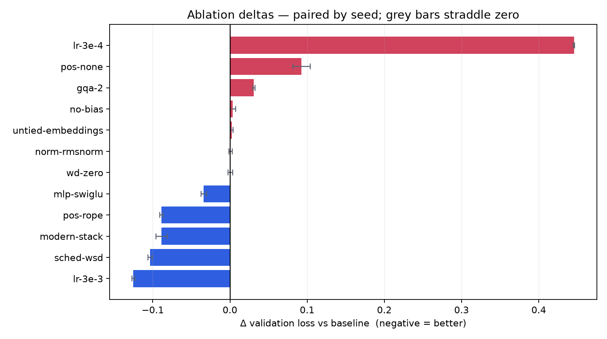

# Ablation study: what actually helps a 51M decoder

Twelve design choices, each varied against a shared baseline, each run at three
seeds. 39 runs, 7.6 GPU-hours on one H100, ~$25.

The headline is that **the two largest effects are not architectural.** The learning
rate and its schedule move validation loss more than every architecture change in the
study combined. Among the architecture changes, only RoPE and SwiGLU do anything to
loss at all; RMSNorm, no-bias and GQA are throughput and memory decisions that cost a
little quality or none.

---

## Setup

| | |
| --- | --- |
| Model | 51.2M parameters — 8 layers, 512 wide, 8 heads, 512 context |
| Data | FineWeb-Edu, 524M tokens per run (10 tokens/parameter) |
| Baseline | LayerNorm, learned positions, GELU, tied embeddings, bias, MHA, cosine, lr 1e-3 |
| Seeds | 1337, 1338, 1339 — **every arm at all three** |
| Metric | Validation loss on a held-out FineWeb-Edu shard |

Each arm changes exactly one thing. That is enforced by a test rather than by care:
`test_ablation_arms_differ_from_their_baseline_in_one_axis_only` asserts every config
differs from `_base.yaml` in its own named field and nothing else.

### Why every arm ran at the same seeds

Because otherwise most of this study would have been unreadable.

Two runs of the *identical* config, differing only in seed, land **0.0043** apart.
Compared as means, an arm has to beat that spread before anything can be claimed — and
four of the twelve effects here are smaller than 0.0043. They would all have been
reported as "no difference".

Running every arm at the same seeds allows a **paired** comparison: each arm is
differenced against the baseline run that saw its data *in the same order*, and the
three differences are examined for agreement. Batch ordering is the dominant component
of seed variance, and differencing within a seed cancels it. `no-bias` is the clearest
demonstration — its effect (+0.0038) is *smaller* than the seed spread (0.0043), yet
all three seeds agree on the sign, so it resolves.

An arm counts only when the range of its per-seed deltas does not straddle zero. This
is a deliberately blunt rule, not a p-value; with three seeds nothing stronger would be
honest. It is exactly what the error bars in the plot show.

---

## Results

Negative delta = lower loss = better. ± is the half-range across the three paired
differences.

| Arm | What varied | Val loss | Δ vs baseline | Verdict | Throughput |
| --- | --- | --- | --- | --- | --- |
| `lr-3e-3` | lr 1e-3 → 3e-3 | 3.7864 | **−0.1251 ± 0.0019** | better | +1.1% |
| `sched-wsd` | cosine → WSD | 3.8082 | **−0.1034 ± 0.0026** | better | +0.8% |
| `modern-stack` | all modern components | 3.8229 | **−0.0886 ± 0.0074** | better | ±0.0% |
| `pos-rope` | learned → RoPE | 3.8229 | **−0.0886 ± 0.0021** | better | −2.3% |
| `mlp-swiglu` | GELU → SwiGLU | 3.8774 | **−0.0341 ± 0.0035** | better | −2.2% |
| `wd-zero` | weight decay 0.1 → 0 | 3.9120 | +0.0004 ± 0.0030 | within noise | +0.9% |
| `norm-rmsnorm` | LayerNorm → RMSNorm | 3.9123 | +0.0007 ± 0.0021 | within noise | +1.3% |
| `untied-embeddings` | tied → untied | 3.9141 | +0.0025 ± 0.0017 | worse | −0.1% |
| `no-bias` | bias → no bias | 3.9153 | +0.0038 ± 0.0037 | worse | **+4.2%** |
| `gqa-2` | 8 KV heads → 2 | 3.9426 | +0.0311 ± 0.0012 | worse | +2.0% |
| `pos-none` | learned → none | 4.0044 | +0.0928 ± 0.0110 | worse | +1.1% |
| `lr-3e-4` | lr 1e-3 → 3e-4 | 4.3572 | +0.4457 ± 0.0010 | worse | +0.9% |

Baseline: **3.9116**, seed spread **0.0043**.



---

## Findings

### The optimiser dominates the architecture

`lr-3e-3` (−0.1251) and `sched-wsd` (−0.1034) are the two largest effects in the
study. Together they are larger than every architecture change combined. `lr-3e-4`
(+0.4457) is larger still in the wrong direction — a 3× learning-rate reduction costs
more than four times what removing positional information entirely costs.

This is worth stating plainly because it inverts the usual emphasis. A great deal of
attention goes to whether a model uses RMSNorm or LayerNorm, and at this scale that
choice is worth 0.0007 while the learning rate is worth 0.125 — **180× more**.

**I predicted `lr-3e-3` would diverge, and it did not.** It produced the best loss in
the study. That is a more useful result than the one expected, and it carries an
uncomfortable implication: the baseline learning rate of 1e-3 was too conservative, so
every other arm here was measured at a suboptimal setting. See the caveats.

### RoPE is the only architecture change that clearly earns its place

−0.0886, consistent across seeds, and by some margin the largest architectural effect.

The likely mechanism is that rotary embeddings encode *relative* position directly in
the attention logit — the dot product between a rotated query and key depends only on
their offset — whereas a learned table has to spend capacity discovering that
translation-invariance from data. At 524M tokens there is not much budget for
discovering it, so the built-in inductive bias pays.

The `pos-none` control supports this reading. Removing position entirely costs +0.0928,
so the learned table is worth about that much over nothing, and RoPE is worth about as
much again over the table. Notably, a decoder with *no* positional encoding is only
0.09 worse than one with a learned table — causal masking alone leaks a great deal of
positional information, which is why that control was worth running.

RoPE costs 2.3% throughput here, from rotating queries and keys every layer.

### SwiGLU helps — but this arm is 4.11% larger, and that has to be said

−0.0341, consistent across seeds. The intent of the 2/3 hidden-width scaling is that a
SwiGLU block, which has three projections instead of two, ends up with the same parameter
count as the GELU block it replaces — so the ablation measures the gating rather than the
size.

**At this scale it does not quite hold.** `mlp_hidden` rounds the scaled width up to a
multiple of 256, and whether that rounding lands back on the GELU count depends on
`n_embd`. At the reproduction's 768 it is exact (2048 either way). At this sweep's 512 the
2/3 width is 1365, which rounds up to 1536, and the SwiGLU block ends up with **12.5% more
parameters** than the GELU block — **4.11%** more in the model as a whole. The test that
asserted "within 5%" ran at 768, the width where the claim is trivially true, and the sweep
ran at 512.

So −0.0341 is an upper bound on the gating effect, not a clean measurement of it. It is
still the right sign and still small next to the optimiser arms, and 4% more parameters at
10 tokens/parameter buys very little — but the honest statement is that this arm varies two
things, and the study's own single-axis discipline is what makes that worth flagging rather
than absorbing. Re-running it at 768, or at any width where the rounding is exact, would
settle it. `tests/test_norm_and_mlp.py` now pins the ratio at five widths, so which of them
are honest is no longer something a reader has to work out.

It costs 2.2% throughput — three projections rather than two, partly offset by fusing
gate and up into one GEMM.

### RMSNorm is free, not better

+0.0007, straddling zero — the clearest "no effect" in the study, and the expected one.
RMSNorm drops LayerNorm's mean-centring and bias; the ablation says that removing them
costs nothing measurable.

That is the whole case for it. It is **+1.3% throughput** for no quality cost, which is
why every modern decoder uses it. An ablation that reported this as "no result" and
stopped would have missed the point: the finding is that you get the speed for free.

### GQA is a memory decision, and the table cannot see the benefit

+0.0311 — small but unambiguous, every seed agreeing. Dropping from 8 KV heads to 2
costs real quality.

Read on loss alone that looks like a straightforward loss. It is not: the same change
makes the KV cache **4× smaller**, which is the constraint that decides how many
concurrent sequences fit in memory during inference and how long a context is
affordable. This arm has to be read against the inference benchmarks rather than
against this table, and it is the clearest case in the study of validation loss being
the wrong single metric.

### No-bias is the best throughput trade here

+0.0038 loss for **+4.2% throughput** — the largest speed gain in the sweep, for the
smallest significant quality cost. Bias terms add a dependent elementwise op after every
matmul without adding expressiveness the weights cannot supply.

This is also the arm the paired design exists for. Its effect is *smaller* than the
seed spread; comparing means it would have been dismissed as noise. All three seeds
agreeing on the sign is what makes it a result.

### Untied embeddings do not pay for themselves

+0.0025 — untying is slightly *worse* despite adding 25.8M parameters: a second copy of
the token embedding, and about as much again as every block in the model put together
(25.2M).

The likely explanation is data, not capacity. At 524M tokens the output embedding
sees each vocabulary item comparatively rarely, so an untied output matrix is
undertrained where a tied one inherits everything the input embedding learned. This is
the arm most likely to reverse at scale, and it is deliberately not parameter-matched
— the question is whether those parameters are better spent here than anywhere else,
and at this budget the answer is no.

### Weight decay does nothing at this budget

+0.0004, straddling zero. Weight decay regularises against overfitting, and a single
pass over 524M fresh tokens presents nothing to overfit — no example is seen twice.
This would be expected to matter in a multi-epoch regime and does not here.

---

## The components are additive

`modern-stack` combines RoPE, SwiGLU, RMSNorm, no-bias and GQA. If the individual
effects do not interact, their sum should predict it:

```
pos-rope       -0.0886
mlp-swiglu     -0.0341
norm-rmsnorm   +0.0007
no-bias        +0.0038
gqa-2          +0.0311
               -------
predicted      -0.0872
observed       -0.0886     (difference -0.0014)
```

The prediction lands within 0.0014 — a third of the seed noise floor. At this scale
these five changes compose without interacting, which is a genuinely useful result: it
means components can be evaluated independently and combined, rather than requiring the
full 2⁵ cross-product to be searched.

The caveat is that additivity was tested at one point, not established in general. Five
components combining cleanly does not guarantee a sixth will.

---

## Loss is not the only axis

The sweep measured throughput as a side effect, and the ranking differs from the loss
ranking:

| | Δ loss | Δ throughput |
| --- | --- | --- |
| `no-bias` | +0.0038 | **+4.2%** |
| `gqa-2` | +0.0311 | +2.0% |
| `norm-rmsnorm` | +0.0007 | +1.3% |
| `mlp-swiglu` | −0.0341 | −2.2% |
| `pos-rope` | −0.0886 | −2.3% |

The two changes that improve loss both cost throughput, and the three that cost loss
all improve it. `modern-stack` combines them to a net **±0.0%** — it buys −0.0886 of
loss for no throughput penalty at all.

That is the practical case for the modern stack, and it is invisible in a table that
reports only loss.

---

## Caveats

These matter, and they are ordered by how much they could change the conclusions.

**Every arm ran at a learning rate now known to be suboptimal.** `lr-3e-3` beat the
1e-3 baseline by 0.125, so the baseline was not at its optimum. Architecture changes
can interact with learning rate — RMSNorm and no-bias both alter gradient scale — so an
arm's measured effect might differ if each were re-tuned. Doing that properly means a
learning-rate sweep per arm, which is roughly 5× the compute this study used. The
honest position is that these are effects **at a fixed, suboptimal learning rate**, not
effects at each arm's own optimum.

**Undertrained by design.** 524M tokens for a 51M model is 10 tokens/parameter, half
Chinchilla-optimal. That budget bought three seeds per arm instead of one longer run,
which is what made anything below 0.0043 measurable at all. But effects that appear
late in training — `untied-embeddings` is the obvious candidate — are systematically
underrepresented.

**One scale, one shape.** 51M parameters at 512 context. Conclusions transfer in
*direction*, not in magnitude, and not necessarily at all: the RoPE advantage in
particular would be expected to grow with context length, which was not varied.

**Three seeds is a weak test.** The significance rule is a sign-agreement heuristic. It
cannot distinguish a genuine +0.002 effect from a fortunate coincidence with any real
confidence, and the arms nearest the noise floor — `untied-embeddings`, `no-bias` —
carry the least weight of anything reported here.

**Single-metric.** Validation loss only. `gqa-2` is the clearest case where that is the
wrong question, and no downstream benchmark was run at ablation scale.

---

## What I would do next

1. **Re-run at the corrected learning rate.** `lr-3e-3` won, so sweep 3e-3 / 6e-3 / 1e-2
   to find the actual optimum, then re-baseline. Everything here shifts if that moves.
2. **Pair each arm with its own learning rate.** Expensive, but the only way to
   distinguish "this architecture is better" from "this architecture prefers a
   different learning rate".
3. **Read `gqa-2` against the inference benchmarks.** +0.0311 loss for a 4× smaller KV
   cache is either an obvious trade or an obvious mistake, and the loss table cannot
   say which.
4. **Extend the context length.** RoPE's advantage should grow with it; a study at 512
   tokens cannot see the property rotary embeddings are principally chosen for.

---

*Generated from `results/ablations.json` — 39 runs, all raw numbers and per-seed values
included. Reproduce with `llmfs-ablate --seeds 3` and `llmfs-ablate-report`.*
