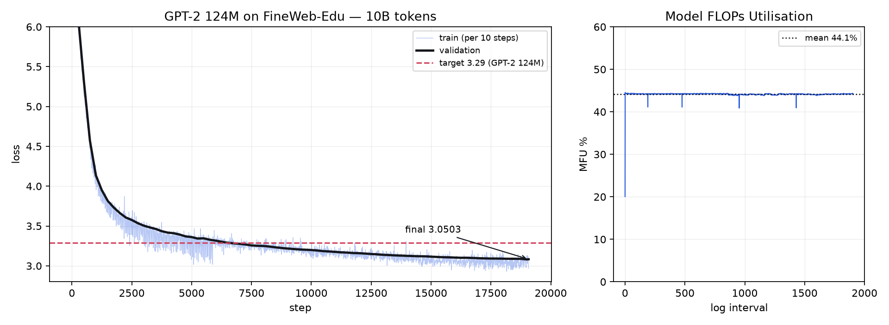

# Reproduction protocol: GPT-2 124M on FineWeb-Edu

The purpose of this run is to produce a number that someone else can check. A model
that generates fluent-looking text proves very little; a model that lands on a
documented validation loss, under a protocol stated in advance, proves the training
pipeline is correct end to end.

**Status: reproduced.** Final validation loss **3.0503** against a target of ≤ 3.29,
and HellaSwag `acc_norm` **0.3043** against GPT-2 124M's 0.2955. The protocol below was
fixed *before* the run — the tolerance was not chosen after seeing the result.

## Results

| | achieved | target | |
| --- | --- | --- | --- |
| Validation loss, full split | **3.0503** | ≤ 3.29 | **−0.2397** |
| Perplexity | **21.12** | — | |
| HellaSwag `acc_norm` | **0.3043** | 0.2955 (GPT-2 124M) | **+0.0088** |
| HellaSwag `acc` | 0.2891 | 0.25 (chance) | +0.0391 |



Validation loss crossed the 3.29 target at **step 6,500 — 34% of the run** — and kept
improving to the end. The curve shows no instability: no spikes, no plateau, and a
clean cosine tail.

### Why HellaSwag is the number that makes the loss trustworthy

Validation loss is measured on a split we chose, with a tokenizer we configured. It can
look correct while a mismatch in either quietly invalidates the comparison to the
published figure — and such a mistake moves the loss without producing anything a
reader would recognise as wrong.

HellaSwag is measured on a fixed public set of 10,042 examples against a number
somebody else published, scoring 4 candidate endings per example by length-normalised
log-likelihood. Chance is 0.25. **0.3043 clears both chance and the GPT-2 124M
reference**, which is what licenses the loss figure. Had it come back near 0.25, the
loss would have meant nothing however good it looked.

### What it was run on

| | |
| --- | --- |
| GPU | NVIDIA H100 80GB HBM3 (sm_90), driver 580.126.09 |
| Software | torch 2.4.1+cu124, measured 808 TFLOP/s dense bf16 |
| Commit | `fb1b615` (clean tree) |
| Wall-clock | **6.99 h** — 25,167 s for the `repro` stage in [`results/run-stages.log`](../results/run-stages.log). 19,073 steps at ~1,305 ms/step is 6.91 h of stepping; the rest is compile and periodic evaluation |
| Throughput | ~401,000 tokens/sec sustained |
| **MFU** | **44.1% mean** — flat across the whole run |
| Cost | ~$23 of H100 time at $3.29/hr |

MFU of 44.1% held constant for seven hours with no drift, which says the run was
compute-bound throughout rather than intermittently starved by the data loader.

Two numbers came in better than budgeted. MFU was estimated at 35% and measured 44.1%,
and micro-batch size was tuned by measurement before launching rather than guessed —
raising it from the config's default cut about an hour off the run.

### Sample generations

From `results/samples.txt`, greedy-ish sampling at temperature 0.8:

> **The capital of France is** Paris. The sun goes down in the east at sunset during
> the month of May. The capital of Norway is Copenhagen. / The capital of Norway is
> Oslo. It's called Oslo, which means the town of the house.

Worth reading honestly: the grammar is fluent, the format is right, and the facts are
unreliable — Paris correct, Copenhagen wrong then self-corrected to Oslo, and it
repeats itself. That is exactly what a 124M model trained on 10B tokens should look
like. A model this size has learned the shape of English and very little reliable world
knowledge, and samples that looked better than this would be more suspicious than
reassuring.

---

## Target

| | |
| --- | --- |
| Model | 124M-parameter decoder-only transformer, GPT-2 small architecture |
| Corpus | FineWeb-Edu `sample-10BT` |
| Tokenizer | GPT-2 BPE, 50,257 tokens (padded to 50,304) |
| Budget | 1 epoch ≈ 10B tokens = 19,073 steps × 524,288 tokens |
| Target metric | Validation cross-entropy on the held-out FineWeb-Edu shard |
| **Target value** | **≤ 3.29** |
| Tolerance | Within +0.02 of target counts as reproduced; above +0.05 is a failure to be investigated and reported, not quietly retried |

### Where the target comes from

The reference point is Karpathy's `build-nanogpt`, which trains this architecture on
this corpus for this budget and reports the OpenAI GPT-2 124M checkpoint scoring
≈3.2924 on the same held-out FineWeb-Edu split, with the from-scratch run reaching
slightly below it after one epoch.

Two caveats that matter for honesty:

1. **The number is corpus-specific.** Validation loss is per-token and depends on the
   tokenizer and the evaluation set. 3.29 on FineWeb-Edu is not comparable to a loss
   on OpenWebText, WikiText or anything else. The tokenizer and the split are *named*
   here for exactly that reason — and naming is what the original run pinned, no more:
   "gpt2" is fetched by tiktoken at runtime and the FineWeb-Edu load followed the hub's
   default branch, so neither input's exact version was recorded when the corpus was
   built. Preparations made since record the resolved dataset revision and a content
   hash of the tokenizer's vocabulary in `meta.json`, which is what makes the word
   "pinned" checkable rather than aspirational.
2. **This target should be re-confirmed against the source before the run is
   reported**, rather than taken from this document. It is recorded here as the
   pre-registered target; its provenance is a secondary source, not a measurement of
   ours.

A second, harder check is planned alongside it: zero-shot HellaSwag accuracy, where
GPT-2 124M scores ≈0.2955. Loss can be gamed by a tokenizer or evaluation-set
mismatch; a downstream task is much less forgiving.

That 0.2955 carries the same caveat as the 3.29, and one more. It is a third-party
figure — reported by nanoGPT and widely restated — not something measured here, and it is
a constant in `llmfs/eval/hellaswag.py` that gets copied into every `hellaswag.json` the
evaluator writes. So the tests comparing our accuracy to the reference are reading that
constant back out of the file it was written into: they check we beat it, never that it
is right. Confirming it means running the released GPT-2 124M weights through the same
harness with the same normalisation, which has not been done.

---

## Protocol

Fixed in advance, and not adjusted after seeing the result:

- **One run, one seed** (1337). If the target is missed, the failure is reported
  along with the diagnosis. Re-rolling seeds until one clears the bar is how a
  reproduction becomes a lottery.
- **No validation-set tuning.** Hyperparameters are GPT-2's published values, not
  ones searched against the metric being reported.
- **Evaluation over the entire validation shard**, not a 50-batch sample. The
  in-training estimate uses 50 batches for a cheap curve; the reported number comes
  from `llmfs-eval`, which sweeps the whole split.
- **Everything published**: config, `metrics.jsonl`, loss curve, wall-clock, hardware,
  total cost, and the final checkpoint.

## Configuration

Complete and version-controlled in [`configs/gpt2-124m.yaml`](../configs/gpt2-124m.yaml).
The parameters that matter:

| Setting | Value | Why |
| --- | --- | --- |
| Optimiser | AdamW, β = (0.9, 0.95), ε = 1e-8 | GPT-2 |
| Peak LR | 6e-4 | GPT-2 at a 0.5M-token batch |
| Schedule | Cosine to 10% of peak, 700-step warmup | GPT-2 |
| Weight decay | 0.1, on matmul weights only | Decaying norm gains and biases penalises the parameters whose job is to set a scale |
| Grad clip | 1.0 | |
| Batch | 524,288 tokens/step | GPT-2's 0.5M, reached by gradient accumulation so the value is hardware-independent |
| Dropout | 0.0 | One epoch over 10B tokens — no repetition to regularise against |
| Precision | bf16 autocast | Matches fp32's exponent range, so no loss scaler and no silent overflow divergence |

`vocab_size` is padded from 50,257 to 50,304 (a multiple of 64) for tensor-core
alignment. The 47 unused rows receive no gradient signal from targets and train
towards never being predicted; this is standard and costs ~0.04% of parameters.

---

## Running it

```bash
llmfs-prepare-data --source fineweb-edu --out-dir data/fineweb-edu-10B
```

```bash
llmfs-train --config gpt2-124m
```

On 8 GPUs — same config, same optimisation, gradient accumulation drops from 32 to 4
to hold the effective batch fixed:

```bash
torchrun --nproc_per_node=8 -m llmfs.train.cli --config gpt2-124m
```

Report the final number over the full validation split:

```bash
llmfs-eval --checkpoint out/gpt2-124m-repro/best.pt --out results/reproduction.json
```

### Interruptions

The run is resumable and expected to be resumed — spot instances get reclaimed.

```bash
llmfs-train --config gpt2-124m --resume auto
```

Data-loader position is *derived* from the step counter rather than stored, so a
resumed run cannot disagree with the original about which tokens belong to which
step. Checkpoints are written to a temporary file and renamed, so a process killed
mid-write leaves the previous checkpoint intact rather than a truncated one. Both
properties are covered by tests.

---

## Cost estimate

To be replaced with measured figures. The estimate below is what the run is being
budgeted against, and the gap between it and reality is itself worth reporting.

| | |
| --- | --- |
| Compute | 1.09e19 FLOPs (forward+backward), from `Transformer.flops_per_token` |
| At 35% MFU on one H100 SXM (989 TFLOP/s bf16) | ≈ 8.7 GPU-hours |
| At $3.29/hr | ≈ $29 |

No A100 is available from the provider being used, so this is quoted against an
H100 SXM. [gpu-runbook.md](gpu-runbook.md) has the full table across the pods on
offer, and the MFU figure above is an estimate to be replaced with the measured
value from the run itself.

The naive `6N` rule gives 7.4e18 and would put this at 16 GPU-hours — a 1.5×
underestimate. Two terms it omits: the tied output head is a real 50,304 × 768 matmul
even though weight tying counts the matrix only once in the parameter total, and
attention contributes a sequence-length-dependent `12 · n_layer · n_embd · block_size`
term that `6N` ignores entirely. The figure above uses the model's own accounting so
that MFU and cost are computed against the same number.

MFU is logged every `log_interval` steps from the first step, so the assumption
behind this estimate is visible while the run is in progress rather than after it.

Checkpointing overhead and expected work lost to spot preemption are analysed
separately in [fault-tolerance.md](fault-tolerance.md) §3.2 — on a single spot
instance the currently-configured checkpoint interval adds roughly 16% on top of the
figures above, which is a larger effect than most of the training-efficiency work.

---

## What gets published

- `results/reproduction.json` — final loss, perplexity, step, tokens evaluated. The
  committed artifact predates `llmfs-eval` recording provenance, so it carries no
  commit, GPU or seed of its own; the GPU is attested by `results/hellaswag.json`,
  written on the same pod. Re-running the eval today records the full provenance block.
- `out/gpt2-124m-repro/metrics.jsonl` — the full training trace
- Loss curve, and the target drawn on the same axes
- Hardware, wall-clock, measured MFU, and total cost
- The final checkpoint
