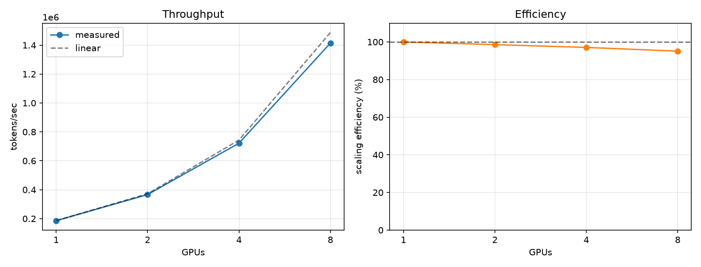
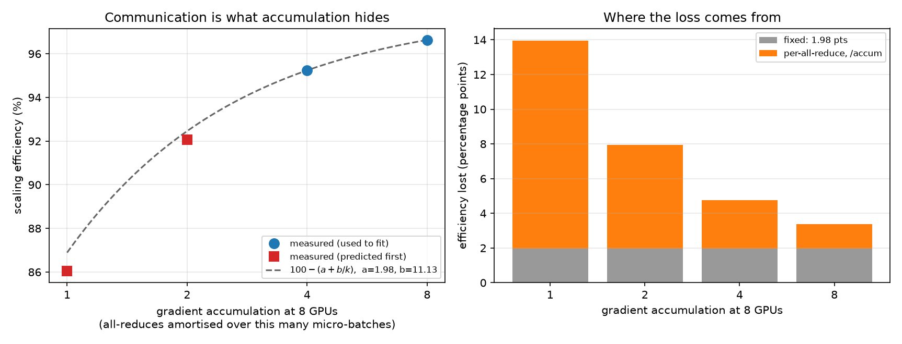

# Multi-GPU scaling

Eight RTX 5090s, no NVLink, reaching **95.1% scaling efficiency** and **1.54 PFLOP/s** of
useful training compute, while taking provably the same optimisation steps as one GPU.

Measured with `llmfs-scaling`, which runs the **real trainer** at each world size via
`torchrun` rather than a synthetic benchmark loop. That is deliberate: a hand-written loop
would measure a program nobody trains with, and would omit the two things most likely to
spoil scaling: the gradient all-reduce and the optimiser step.

```bash
./scripts/gpu.sh scaling 5090x8
```

---

## Results

8× RTX 5090 (32 GiB, `sm_120`), torch 2.8.0+cu128, `gpt2-124m` at a 524,288-token batch,
50 steps per point with the first 15 discarded as warmup, medians over the remaining 35.

| GPUs | grad accum | tokens/sec | per GPU | ms/step | speedup | efficiency | achieved | max Δloss vs 1 GPU |
| --- | --- | --- | --- | --- | --- | --- | --- | --- |
| 1 | 32 | 185,928 | 185,928 | 2,819.8 | 1.00× | — | 202 TFLOP/s | baseline |
| 2 | 16 | 366,469 | 183,234 | 1,430.6 | 1.97× | **98.6%** | 398 TFLOP/s | 1.6e-05 |
| 4 | 8 | 721,904 | 180,476 | 726.3 | 3.88× | **97.1%** | 785 TFLOP/s | 1.4e-05 |
| 8 | 4 | **1,414,340** | 176,793 | 370.7 | **7.61×** | **95.1%** | **1,538 TFLOP/s** | 4.4e-05 |



`achieved` is derived from the model's own `flops_per_token` (1.087 GFLOP/token at 1024
context), not from a vendor spec; see [MFU](#what-mfu-would-require) below.

---

## The optimisation is unchanged, and that is the claim that matters

A scaling report that only reports throughput is answering the easy question. The hard one
is whether eight GPUs are still training the *same model*, because the fast ways to be
wrong here (dropping the accumulation, letting each rank optimise its own shard, syncing
the wrong tensor) all make the throughput number *better*.

`tokens_per_step` is fixed at 524,288 **in tokens**, and gradient accumulation is derived
from it, the micro-batch and the world size. The accum column shows that working: 32, 16,
8, 4 as the world size doubles. The product is held constant, so the effective batch never
moves and eight GPUs take the same optimisation steps as one, only faster.

The evidence is the loss at step 1, across the four independent runs:

```
1 GPU: 10.951740264892578
2 GPU: 10.951740264892578
4 GPU: 10.951740264892578
8 GPU: 10.951739311218262
```

Identical to sixteen significant figures at 1, 2 and 4 GPUs; differing in the last two
digits at 8. Over all 50 steps the largest divergence is **4.4e-05** against a loss of
~8.6, five parts per million, and it does not grow with world size (1.6e-05, 1.4e-05,
4.4e-05). A real bug would show *drift*: a delta compounding step over step. This is
floating-point reduction order, which is the irreducible amount of difference.

That check required fixing something first. Only the *eval* loss was being all-reduced;
the logged training loss was rank 0's own micro-batches, one Nth of the effective batch,
so it got noisier as the world grew and a multi-GPU curve could not be compared against a
single-GPU one at all. The optimisation was always correct, since DDP averages the
gradients regardless; the logged number simply did not describe the batch that had been
trained on.

---

## 95% on PCIe, and why that is not luck

There is **no NVLink on this machine.** `nvidia-smi topo -m` is recorded verbatim in the
results file, and it is worse than a flat PCIe fabric: this is a dual-socket box with GPUs
0–3 on NUMA node 0 and 4–7 on node 1. Every cross-group pair reads `SYS`: PCIe *plus* the
inter-socket link. So the 8-GPU all-reduce traverses the slowest path the topology offers,
and per-GPU throughput still fell only **4.9%**.

The reason is gradient accumulation, and specifically `no_sync`. DDP all-reduces gradients
on every backward pass by default. During accumulation only the last micro-step needs to
sync, so the other `grad_accum - 1` run under `model.no_sync()`:

```python
sync = micro_step == self.grad_accum_steps - 1
ctx = model.no_sync() if (self.dist.enabled and not sync) else nullcontext()
```

At world size 8 the accumulation is 4, so there is **one all-reduce per four micro-batches**
; the communication is amortised over 4× the compute. The trainer's comment claimed this
was "the difference between communication-bound and compute-bound." That is no longer a
claim: 95.1% over the worst interconnect in the building is the number behind it.

The corollary is the honest one. **This result says the interconnect barely matters at this
scale**, not that PCIe is as good as NVLink. A 124M model with a 0.5M-token batch does
enough arithmetic per optimiser step to hide a slow all-reduce. Scale the model up or the
batch down and that stops being true.

---

## Where the efficiency goes

Efficiency falls **1.5–2 points per doubling**: 98.6 → 97.1 → 95.1, i.e. −1.45, −1.48,
−1.98. Close to linear in `log2(N)`, which is the shape to expect when the cost is a
ring/tree all-reduce whose depth grows logarithmically with rank count.

The slight steepening into 8 GPUs is where the NUMA boundary first has to be crossed: at 4
GPUs the group fits inside one socket (`NODE`), at 8 it does not (`SYS`). One point of
extra loss is a cheap price for crossing sockets, and it is the only place in this data
where the topology is visible at all.

Extrapolating the trend, 16 GPUs on this fabric would land near 93%. That is an
extrapolation from three points, not a measurement.

---

## The wall clock is compile, not stepping

Worth knowing before anyone budgets a sweep like this, and it surprised me:

| GPUs | run wall-clock | of which stepping | fixed overhead |
| --- | --- | --- | --- |
| 1 | 174.5s | 141.0s (80.8%) | 33.5s |
| 2 | 758.9s | 71.5s (9.4%) | 687.3s |
| 4 | 725.6s | 36.3s (5.0%) | 689.3s |
| 8 | 709.4s | 18.5s (2.6%) | **690.9s** |

At world size 8, **97% of the run was not training.** And the overhead is near-constant at
~690s for every multi-rank run while being only 33s for single-rank, a 20× jump between
one rank and two, then flat.

The likely cause is `torch.compile` under DDP: inductor's DDPOptimizer splits the graph at
gradient-bucket boundaries and compiles each subgraph separately, so a distributed run
compiles several graphs where a single-GPU run compiles one. The flatness across 2, 4 and 8
fits that: the same number of subgraphs, compiled in parallel across ranks. **This is a
hypothesis consistent with the timings, not something measured here**; isolating it would
mean timing compilation directly.

Two practical consequences. Estimating this sweep from stepping time gave ~10 minutes; it
took 39.5. And since the cost is fixed per run rather than per step, **more steps are
nearly free**, which retroactively justifies raising this sweep from 30 steps to 50, and
means anyone reusing the harness should raise it further rather than economise.

---

## Utilisation, and why `mfu` is null

Every `mfu` field in the results file is `null`, and it stays that way. MFU needs a
peak-FLOP/s figure and `peak_flops()` has no entry for `sm_120`. Rather than guess one, the
card was benchmarked directly on the same pod: a 8192³ bf16 matmul, the same probe
`bootstrap.sh` runs:

**234.7 TFLOP/s measured.**

That number is not in `results/`. The probe printed it to a terminal on a pod that has
since been destroyed, and nothing captured it, so it is the one figure in this document
backed by a note rather than a file, and it denominates the whole column below and the MFU
refusal above. `bootstrap.sh` now writes `results/gpu-probe-<arch>.json` on every pod it
sets up, so the next run of this experiment commits its own ceiling; this one cannot be
recovered without renting eight 5090s again.

That single number does two things. First it justifies the refusal: a commonly quoted RTX
5090 dense bf16 peak is 209.5 TFLOP/s, and **we measured above it**, so that figure cannot
be the peak for this operation. Had it been pasted into the table it would have produced an
MFU of 96%, a wrong number that looks publishable. The implied true peak is ≥ 234.7, and
if it is the ~419 TFLOP/s that a doubled fp16-accumulate rate would suggest, MFU would be
**48.2%**, squarely in line with the H100 reproduction's 44.1%.

Second, it supports a metric that needs no vendor claim at all: what fraction of the card's
*own measured matmul throughput* does a full training step extract?

| GPUs | achieved per GPU | of measured ceiling |
| --- | --- | --- |
| 1 | 202.1 TFLOP/s | **86.1%** |
| 2 | 199.2 | 84.9% |
| 4 | 196.2 | 83.6% |
| 8 | 192.2 | **81.9%** |

**A complete training step (attention, SwiGLU, RMSNorm, optimiser, all-reduce) runs at
86% of what the card manages on a bare matmul.** There is very little left on the table.
The 4090 measured the same way gives **76.6%**: 118,250 tok/s compiled × 1.087 GFLOP/token
is 128.6 achieved TFLOP/s against that card's own measured 167.9 TFLOP/s, so this is not an
artefact of one card.

That column also re-expresses the scaling result in a way that shows where the cost lands:
86.1% → 81.9% is a 4.2-point loss going from 1 GPU to 8, the same fact as the 4.9% per-GPU
throughput drop, but denominated in the hardware's own capability rather than in the
single-GPU baseline.

**This is not MFU and is not comparable to the 44.1% figure** quoted for the reproduction.
MFU is conventionally computed against the vendor's theoretical dense peak; this is computed
against a measured microbenchmark, which is a lower and more forgiving denominator. Mixing
the two in one table would be the sort of quiet apples-to-oranges comparison this document
exists to avoid, hence a separate column with a different name, and `mfu` left null.

---

## What this does not measure

- **NVLink.** Never measured, and deliberately dropped. PCIe already achieves 95.1% at the
  reproduction's batch, and the accumulation sweep below attributes only ~2.8 of the
  remaining points to the all-reduce itself, so a perfect interconnect could recover about
  three points. Two different machines would have confounded interconnect with
  architecture, memory bandwidth and NCCL version to chase that.
- **Multi-node.** Single node only (`--nnodes=1`). Crossing hosts introduces a network an
  order of magnitude slower than PCIe, and none of these numbers predict that.
- **Larger models.** At 124M, compute per step is large relative to 124M gradients. A 7B
  model changes both sides of that ratio.
- **MFU**, as above.
- **Quality.** No evaluation runs during a scaling sweep (`eval_interval` is set past the
  last step), and the corpus was small enough that train and validation shards hold the
  same 41.8M tokens. Irrelevant to throughput, and it would invalidate any loss claim
  beyond the step-for-step equivalence above, which compares runs against each other
  rather than against a target.
- **The 5090's matmul ceiling, as an artifact.** The 234.7 TFLOP/s above was measured on
  the pod and never written to a file, so the `of measured ceiling` column rests on a
  number this repository cannot show you. `bootstrap.sh` records it from now on. The
  column's *arithmetic* is pinned: `tests/test_documented_results.py` recomputes every
  percentage from the committed throughputs and that one constant, which catches drift in
  the table but cannot vouch for the constant itself.
- **Provenance**, in one artifact only. `results/scaling-5090x8.json` has
  `"provenance": {}` because `capture()` was called with `None` and an over-broad `except`
  swallowed the TypeError. So this file records no commit, torch version or GPU name. Fixed
  afterwards; a failure now records the error and prints a warning instead of silently
  producing an empty dict. The run was `gpt2-124m` on torch 2.8.0+cu128, 8× RTX 5090
  `sm_120`, from `main` at the time of the run. The four `results/comm-accum*.json` files,
  measured after the fix, carry full provenance including commit `89474b8`, torch
  2.8.0+cu128 and `gpu_count: 8`. `llmfs-comm-report results/comm-accum*.json` renders
  them as one table (with `--plot` for the figure); the remote pipeline runs it at the
  end of the sweep.

## Testing the explanation, not just restating it

The `no_sync` account above is an *explanation*, and explanations of pleasing results
deserve more suspicion than the results do; the KV-cache episode in
[docs/efficiency.md](efficiency.md) was exactly a plausible story that stopped an
investigation and hid a 30% bug for weeks.

It also makes a prediction. If 95.1% holds because accumulation amortises the all-reduce
over four micro-batches, then shrinking the amortisation should cost efficiency. So the
world size was held at 8 and `tokens_per_step` varied, which is the only thing that moves
the accumulation. Same machine, same 8 cards, same everything else: no interconnect
comparison needed, and none of the confounds one would carry.

| accum @ 8 GPUs | tokens/step | 1 GPU tok/s | 8 GPU tok/s | per GPU | efficiency | max Δloss |
| --- | --- | --- | --- | --- | --- | --- |
| 8 | 1,048,576 | 186,306 | 1,440,267 | 180,033 | **96.6%** | 1.1e-05 |
| 4 | 524,288 | 185,182 | 1,410,960 | 176,370 | **95.2%** | 9.5e-06 |
| 2 | 262,144 | 185,087 | 1,363,111 | 170,389 | **92.1%** | 1.8e-05 |
| 1 | 131,072 | 184,618 | 1,270,772 | 158,847 | **86.0%** | 2.4e-05 |



The left panel distinguishes the two points the model was **fitted** to from the two it
**predicted**, because which is which is the entire argument; anyone can draw a curve
through data after collecting it. The predicted points sitting slightly *below* the curve is
the residual described above: the model over-predicts efficiency at low amortisation.

Monotonic, and steep at the bottom: with one all-reduce per micro-batch, efficiency falls
to 86.0%. The mechanism is confirmed: communication is what the accumulation was hiding.

**The accum=4 row is a control**, and it reproduces the independent run in the table at the
top of this document to within **0.24%** on throughput and **0.15 points** on efficiency
(1,410,960 vs 1,414,340 tok/s; 95.24% vs 95.09%). Two sweeps a day apart, same hardware,
same numbers.

**Single-GPU throughput barely moves**: 186,306 → 184,618 across an 8× range of batch
size, a spread of 0.9%. That was not assumed: every batch size was run at world size 1 as
well as 8, precisely because efficiency is a ratio and borrowing one baseline across batch
sizes would have divided by the wrong number. It turns out the assumption would have been
safe, which is only knowable by having measured it.

### The quantitative form, predicted before it was measured

With the accum 8 and 4 points in hand, the obvious model is a fixed cost plus a
per-all-reduce cost amortised over the accumulation:

```
loss(accum) = a + b / accum          a = 1.975 pts,  b = 11.134 pts
```

fitted to those **two points only**. Its out-of-sample predictions against what was then
unmeasured:

| accum | predicted | measured | error |
| --- | --- | --- | --- |
| 2 | 92.46% | 92.06% | +0.40 pts |
| 1 | 86.89% | 86.04% | +0.85 pts |

Within 0.85 points across a further 4× reduction in amortisation. So the cost of
distribution here really does decompose into ~2.0 points that do not care about
accumulation (NUMA crossing, launch latency, the optimiser step) and ~11.1 points per
all-reduce, paid once per optimiser step and therefore divided by the accumulation.

The residual is real and worth naming rather than rounding away. The implied
per-all-reduce cost is not quite constant:

| accum | 8 | 4 | 2 | 1 |
| --- | --- | --- | --- | --- |
| implied `b` | 11.13 | 11.13 | 11.93 | 11.98 |

It rises about 7% at low accumulation, so the model slightly *under*-predicts the cost
there. A plausible cause is that with fewer micro-steps there is less backward computation
for DDP to overlap the gradient reduction against, but that is a hypothesis this experiment
does not test.

### What this means for the interconnect

It reframes the NVLink comparison that was originally planned. At accum 4, the
reproduction's configuration, communication costs 4.8 points, of which the model
attributes ~2.8 to the all-reduce itself. **A perfect interconnect could recover at most
those ~2.8 points.** That is the whole prize, and it is why the comparison was dropped in
favour of this experiment: two different machines would have confounded the interconnect
with architecture, memory bandwidth and NCCL version to chase a three-point effect.

But the accum=1 row shows the same interconnect costing 14 points. **The interconnect
matters exactly as much as the batch fails to hide it**, which is the same statement as
"a 124M model with a 0.5M-token batch does enough arithmetic per step to hide a slow
all-reduce", now with a coefficient attached.
